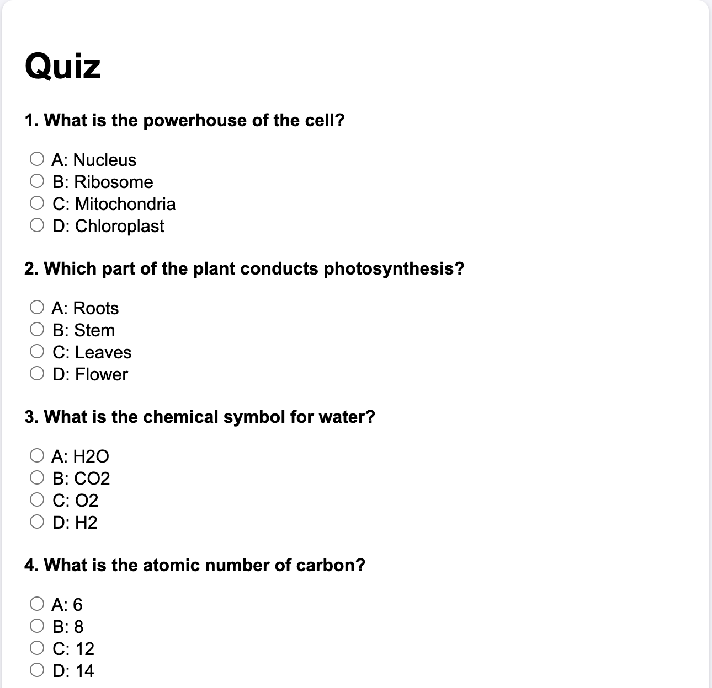

# Quiz App



This project is a web-based quiz application built using **Flask**, **PostgreSQL**, and **HTML/CSS/JavaScript**. The app allows users to take a quiz by presenting questions stored in a PostgreSQL database. It calculates the score based on the user's answers and displays the result.

## Features

- Dynamic question loading from a PostgreSQL database
- Questions include multiple choice options
- User can submit answers and receive a score

## Technologies Used

- **Python** (Flask)
- **PostgreSQL**
- **HTML, CSS, JavaScript** for the front-end

1. **Clone the Repository**

   Clone the repository to your local machine:

   ```bash
   git clone <repo-url>
   cd <project-directory>
   ```
